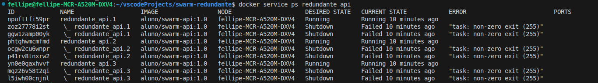
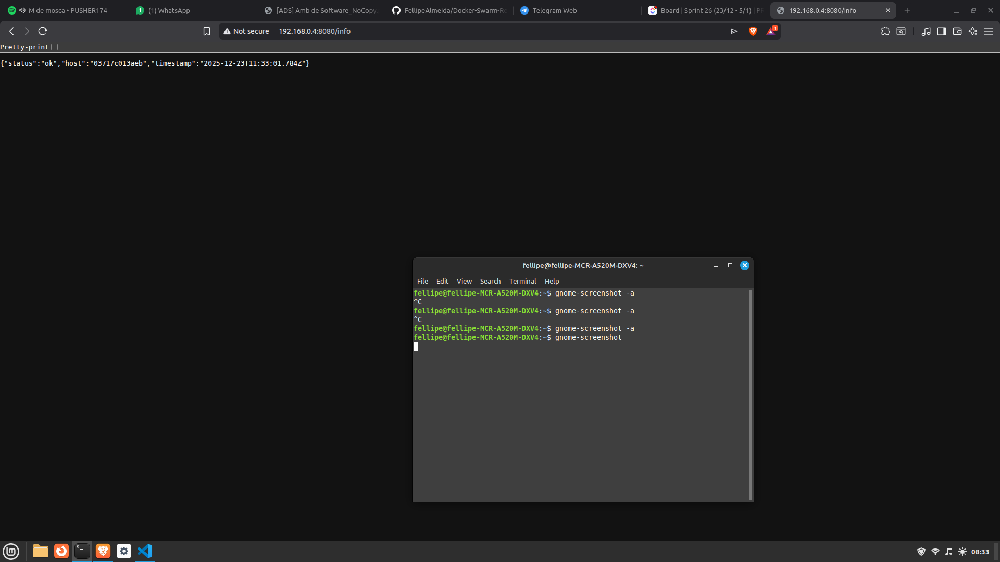
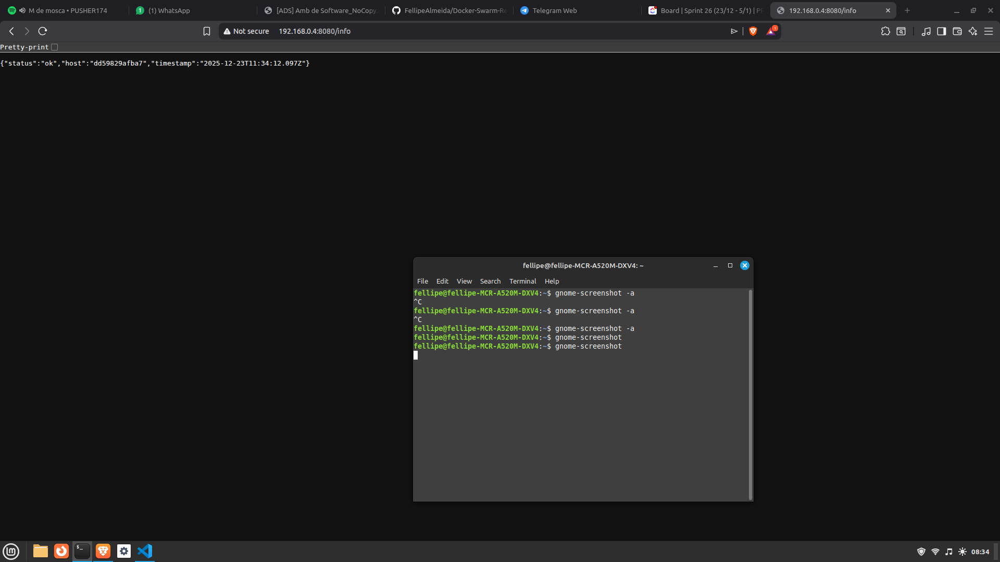
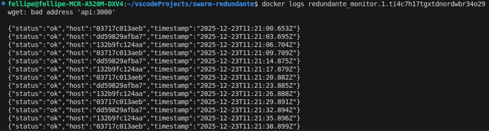
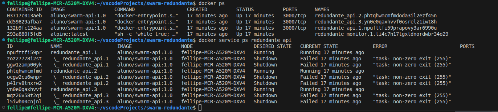
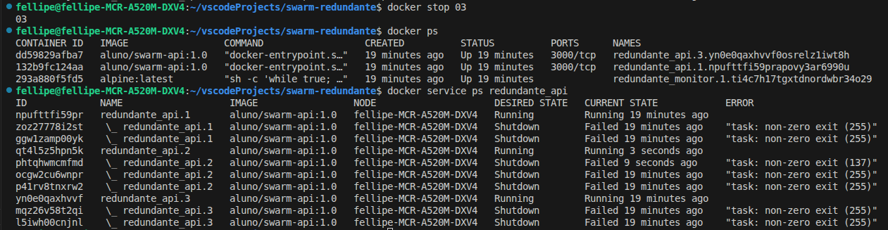

# Atividade de Ambiente de Desenvolvimento de Software

## Estrutura do Projeto
```
swarm-redundante
    api
        app.js
        Dockerfile
        package.json
    docker-compose.yml
```

## Tecnologias do Projeto
- **Javascript**
- **Node.js**
- **Express** 
- **Docker Swarm**

## Como Rodar

``` 
# Clone o projeto
git init
git clone https://github.com/FellipeAlmeida/Docker-Swarm-Redundante

# Inicialize o Docker Swarm com o seguinte comando:
Docker swarm init

# Builda a api
docker build -t aluno/swarm-api:1.0 ./api

# Por fim, crie e gerencie os containers do docker compose
docker stack deploy -c docker-compose.yml redundante
```

# O que está acontecendo?

## Explicação por arquivo

### app.js
É a nossa api, incializa a instância do express e cria duas rotas (/ e /info)

### Dockerfile
Arquivo Dockerfile que faz uma sequência de comandos. Ele faz: 
- define a imagem a ser usada (node)
- define a área de trabalho (/api)
- copia e baixa as dependências do package.json
- expõe a porta 300
- roda a api

### Package.json
É onde fica as depências do projeto

### Docker-compose.yml
- Cria os serviços e rede (api, monitor, appnet)
- no serviço da api defino build e image (porém o build não funciona, por isso roda o comando docker build -t aluno/swarm-api:1.0 ./api)
- define a porta da api
- no deploy defino 3 replicas (containers da api), 1 em paralelismo, e defino a ordem de build das replicas (o que começa primeiro), restarta a replica ao cair e defino a rede
- no monitor uso a imagem do alpine e rodo um comando que roda a api /info a cada 3 segundos (para monitoramento)
- crio a rede appnet

# Como acessar? 

```
localhost:8080

se não funcionar adicione o ip da sua máquina e tente novamente, dessa forma:
docker swarm init --advertise-addr SEU_IP_LOCAL

e acesse pelo seu ip
http://SEU_IP_LOCAL/info
```

# Resultados

```
Ao rodar o comando docker stack services redundante

image.png

esse comando mostra os serviços da stack redundante
```

```
Ao rodar docker service ps redundante_api




```

```
Imagem do rota /info funcionando



Imagem da rota /info novamente, mas dessa vez com outro host (outro serviço da stack)


```

```
Logs do monitor, mostrando vários hosts.



```

```
Antes de parar um container:



Depois de parar:


```
